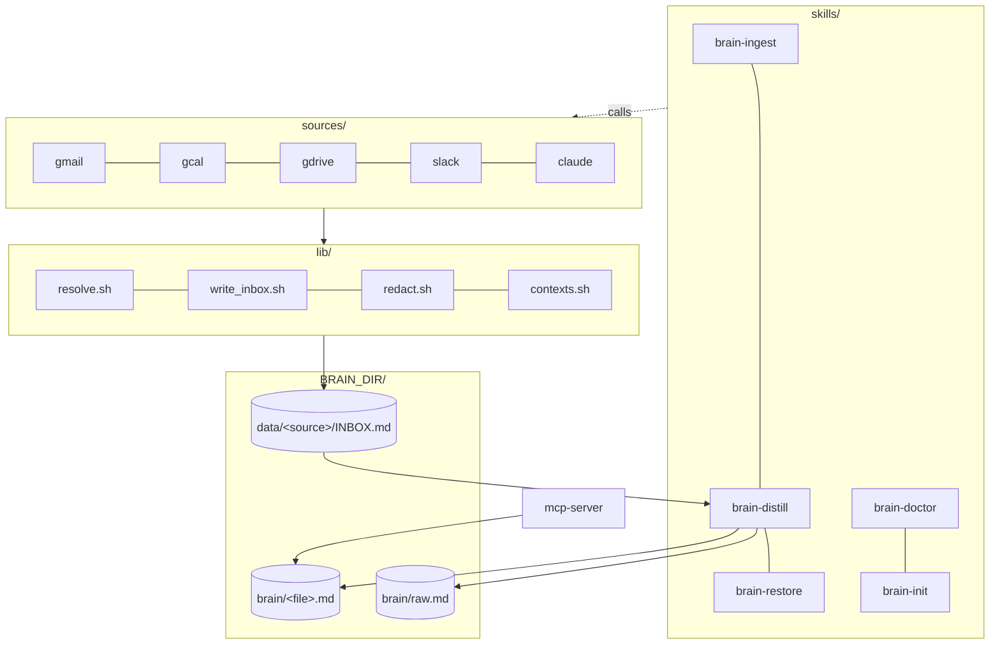

<div align="center">

# `nanobrain`

### the second brain that travels with you across every AI

**Markdown. Git. Vendor-neutral. Forever.**

[](LICENSE)
[](https://github.com/siddsdixit/nanobrain/actions)

[](https://nanobrain.app)
[](https://github.com/siddsdixit/nanobrain)

> **Anthropic gave you Memory inside Claude. Google's giving you Memory inside Gemini. OpenAI's giving you Memory inside ChatGPT.**
>
> Each one locks you in.
>
> **`nanobrain` is the markdown + git equivalent. Yours forever, portable across every agent.**


</div>

---

## Built on Karpathy's LLM Wiki pattern

`nanobrain` is a faithful, code-shaped implementation of Andrej Karpathy's [LLM Wiki gist](https://gist.github.com/karpathy/442a6bf555914893e9891c11519de94f) (April 2026): three-layer corpus (raw / wiki / schema), immutable raw firehose, LLM-owned wiki, schema co-evolution via ADRs, git-native, source-dated entries.

What Karpathy described as a personal pattern, `nanobrain` ships as a framework: same structure, same discipline, plus the capture loop, lint, index, log, and graph machinery that keep the corpus honest at scale. See [`docs/adr/0002-no-yaml-frontmatter.md`](docs/adr/) for where we deviate (we don't).

---

## The pitch in 10 seconds

```bash
$ /brain who is jane

Jane Doe, recruiter at Acme. First contact 2026-03-12 (referred by Sam Park).
Last seen 2026-04-21: pushed for the staff-eng loop. Open ask: salary range.
Backlinks: brain/projects.md (Acme thread), interactions.md (4 entries).
```

```bash
$ /brain what's connected to ledger

8 backlinks. People: Priya Shah. Decisions: 2026-04-15 (Postgres pick),
2026-04-09 (drop multi-currency). Open loops: pricing model, pilot expansion.
```

---

## What it is

`nanobrain` captures every Claude Code session, distills signal from every source you connect (Gmail, Google Calendar, Google Drive, Slack), self-cleans weekly and self-improves monthly, and stores everything as plain markdown in your own git repo.

```
                    ┌──────────────────────────────────────────┐
   Claude session → │  Stop hook (throttled, secrets redacted) │
   Gmail threads  → │  →  data/<source>/INBOX.md (firehose)    │
   Calendar       → │  →  brain/raw.md          (cross-mirror) │
   Google Drive   → │  →  brain/<category>.md   (distilled)    │
   Slack          → │  →  brain/_graph.md       (auto-linked)  │
                    └──────────────────────────────────────────┘
                                       │
                                       ▼
                       /brain who is jane
                       /brain what's connected to project-x
                       /brain spawn branding-agent
                       /brain compact   ←  weekly
                       /brain evolve    ←  monthly self-improvement
                       /brain redact    ←  scrub a leaked secret
```

The brain reads itself. Improves itself. Spawns its own tools. **Forever-durable.** `cat brain/self.md` works in 50 years on any system.

---

## Why this matters

This isn't memory. Memory is "what did I say last Tuesday." Vendor memory features handle that fine.

The actual problem is your **knowledge corpus** lives half in your head, half in scattered notes, half in a thousand AI sessions you can't get back. Your voice. Your taste. Your decisions and the why behind them. Your relationships and how you talk to each one. Every AI agent you start fresh has to be brought up to speed.

`nanobrain` is the bet that your knowledge corpus should be a first-class artifact: **captured automatically while you work, distilled in your voice, queryable by every agent you use, owned by you forever.** The brain builds itself. You don't have to remember to remember.

Plain markdown. Plain git. Read by every agent. Outlives any one vendor's roadmap.

---

## Bootstrap

You need [Claude Code](https://claude.com/claude-code), a GitHub account, macOS or Linux. Install in 2 minutes. Sessions are queued instantly; the first distilled brain entry lands the next time your keyboard is idle for 5+ minutes.

```bash
# 1. Clone the framework
git clone https://github.com/siddsdixit/nanobrain ~/nanobrain

# 2. Create a PRIVATE repo for YOUR brain content
gh repo create my-brain --private --clone

# 3. Install (wires capture hooks + idle distill drainer + skills)
bash ~/nanobrain/install.sh ~/my-brain \
  --work you@company.com \
  --personal you@gmail.com \
  --gh-repo my-brain

# 4. Use Claude Code normally. Step away from the keyboard at some point.
# A few minutes after you go idle:
cat ~/my-brain/brain/decisions.md
```

Capture wires into Claude Code's `Stop`, `SessionEnd`, and `PreCompact` hooks — each is a sub-50ms file append, invisible to you. The distill drainer runs every 30 min via launchd but only does LLM work when your keyboard's been idle for 5+ minutes (or your lid is closed). The brain builds itself in the background; you never wait on it.

---

## What you get

Three loops, each one bash-only and reversible.

| Loop | What ships | How it works |
|---|---|---|
| **Capture** | Always-on hook + 5 source ingests (gmail, gcal, gdrive, slack, claude) | Hook is a sub-50ms file append, never blocks you. Distill happens later via an idle-gated background drainer (every 30 min, only when the keyboard's been quiet ≥5 min). Secrets-redacted by `code/lib/redact.sh` (OpenAI, Anthropic, GitHub, AWS, Slack, JWT, Bearer, inline `api_key=`). Tested in CI. |
| **Query** | `/brain` slash command + MCP server | Agents read brain files through `read_brain_file` with context-filter enforcement (work / personal). Firehoses (raw.md, INBOX.md) are refused. |
| **Maintain** | `/brain-compact` weekly, `/brain-evolve` monthly, `/brain-restore` on demand | Compact dedupes and archives stale entries. Evolve proposes one targeted edit per cycle. Restore creates a branch from any git tag — never resets, never force-pushes. |

Plus: per-entity pages (`brain/people/<slug>.md`, `brain/projects/<slug>.md`), `[[wikilink]]` backlink graph, operation log, auto-generated brain index, lint + integrity hash, agent foundry. Full skill list in [the 17 commands](#the-17-commands) below.

---

## Works with

| Tool | Read brain | Capture session |
|---|---|---|
| **Claude Code** | ✅ MCP | ✅ native Stop hook |
| **Codex CLI** | ✅ MCP | 🟡 wrapper (v2.2) |
| **Cursor** | ✅ MCP | 🟡 wrapper (v2.2) |
| **Gemini CLI** | ✅ MCP | 🟡 wrapper (v2.2) |
| **Aider** | ✅ MCP | 🟡 wrapper (v2.2) |

Activation files at the repo root: `CLAUDE.md`, `AGENTS.md` (Codex / Aider), `GEMINI.md`, `.cursorrules`. Read side works today via MCP. Capture wrappers for non-Claude CLIs ship in v2.2. See [`docs/COMPATIBILITY.md`](docs/COMPATIBILITY.md) for setup per tool.

---

## How it compares

|  | nanobrain | Anthropic Memory | OpenAI Memory | Mem0 / Letta | Notion / Reflect | Vector RAG |
|---|:---:|:---:|:---:|:---:|:---:|:---:|
| Markdown native | ✅ | ❌ | ❌ | ❌ | ❌ | ❌ |
| Works without internet | ✅ | ❌ | ❌ | ⚠️ | ❌ | ❌ |
| You own the data | ✅ | ❌ | ❌ | ⚠️ | ❌ | ⚠️ |
| Readable in 50 years | ✅ | ❌ | ❌ | ❌ | ❌ | ❌ |
| Self-improving | ✅ | ✅ | ✅ | ⚠️ | ❌ | ❌ |
| Multi-agent (Claude / Cursor / Codex / Gemini) | ✅ | ❌ | ❌ | ⚠️ | ❌ | ⚠️ |
| Token cost is constant | ✅ | n/a | n/a | n/a | n/a | ❌ |
| Readable by grep | ✅ | ❌ | ❌ | ❌ | ❌ | ❌ |
| Open source | ✅ MIT | ❌ | ❌ | mixed | ❌ | mixed |

---

## Architecture

Two repos. The framework is public (this repo, MIT). Your content is private (your brain repo). They wire together with one install command.

<div align="center">



</div>

For the capture sequence and three-destination routing diagrams, see [`docs/ARCHITECTURE.md`](docs/ARCHITECTURE.md).

---

## The 17 commands

Three groups: **daily use** (the loop you live in), **maintenance** (sleep cycles + integrity), **recovery** (when something goes wrong).

### Daily use

| Command | What it does | When to run |
|---|---|---|
| **/brain** | Query the brain. Subcommands: `paths` (where files live), `status` (last commit + corpus sizes), `links <entity>` (every `[[backlink]]` to a name across the corpus). | Anytime you need to look something up — who is X, what's connected to Y, where does Z live. |
| **/brain-save** | Force-save a decision, learning, or note mid-session. Routes to the right category file (`decisions.md`, `learnings.md`, etc.), redacts secrets, mirrors to `raw.md`, commits. Optional `--page <slug>` appends a Mention bullet to a per-entity page. | When the capture hook hasn't fired yet but you've just made a real decision worth keeping. |
| **/brain-ingest** | Pull one source into its `INBOX.md` (gmail, gcal, gdrive, slack, claude). Resolver auto-tags each entry with `{context: work\|personal}`. Secrets stripped before write. | Manually, or via the launchd plist that fires on a schedule per source. |
| **/brain-distill** | Read a source's `INBOX.md`, run an LLM pass to extract signal, append targeted blocks to `brain/<file>.md` and a full mirror to `raw.md`. Commits with provenance. | After ingest. The Stop hook chains ingest → distill automatically; run manually for backfills. |
| **/brain-spawn** | Create a specialized agent in `code/agents/<slug>.md` with declared scope (`context_in`, `reads`, `writes`). Spawned agents are context-filtered — they cannot read outside their declared boundaries even if they try. Refuses firehoses (`raw.md`, `interactions.md`) by default. | When a recurring task deserves its own scoped agent — e.g. a "branding" agent that only reads the work side of your brain, or an "investing" agent scoped to personal. |
| **/brain-init** | Bootstrap a new brain: scaffolds `brain/_contexts.yaml`, sets up resolver patterns from your work / personal email flags, creates the directory layout. | Once, at install time. `install.sh` calls this for you. |
| **/brain-doctor** | Health check. Validates `_contexts.yaml`, lists configured sources, pings the MCP server, reports inbox sizes, surfaces GitHub push failures (if `data/_logs/push_failed.txt` exists). | When something feels off, or any time the brain hasn't synced to GitHub recently. |

### Maintenance

| Command | What it does | When to run |
|---|---|---|
| **/brain-compact** | Weekly cleanup: dedupes duplicate dated headers, archives entries older than 365 days into `brain/archive/`, regenerates the graph, verifies the integrity hash, commits. Mechanical only — no LLM, no content rewrites. | Automatically every Monday via launchd, or `bash code/skills/brain-compact/compact.sh` manually. |
| **/brain-evolve** | Monthly self-improvement. Reads the last 30 days of signal and proposes ONE targeted edit to a brain file, written to `code/agents/_proposed/evolve-<timestamp>.md`. You review and `mv` to apply. Single-shot, not auto-applied. | Automatically once a month via launchd, or trigger by hand when you suspect drift. |
| **/brain-checkpoint** | Force-capture mid-session. Synthesizes a `Stop` hook payload with `FORCE_CAPTURE=1`, bypasses the throttle. | Before risky changes, end of a long session, or when you want a guaranteed capture before disconnecting. |
| **/brain-graph** | Rebuild `brain/_graph.md` — an inverted index of every `[[wikilink]]` reference across the corpus, organized by entity with file:line backlinks. Excludes `raw.md` and `interactions.md`. | After bulk edits, or whenever `[[Person Name]]` references stop resolving. The compact pass calls this automatically. |
| **/brain-index** | Rebuild `brain/index.md` — a categorized catalog of every brain file with one-line summaries, per-entity pages tally, sources table. The TOC for the corpus. | After adding new entity pages. The compact pass calls this automatically. |
| **/brain-lint** | Static analysis on the corpus: orphan pages (no incoming `[[backlinks]]`), broken refs, TODO/FIXME markers, duplicate dated headers, entries missing `{context:}` tags. `--strict` exits 1 for CI. | Before publishing or sharing the brain externally. Also useful as a pre-commit hook locally. |
| **/brain-log** | Append one operation line to `brain/log.md` in the format `## [YYYY-MM-DD HH:MM] <op> | <title>`. Greppable: `grep "^## \[" brain/log.md`. | Called automatically by every other skill. Manual invocation is rare. |
| **/brain-hash** | Build or verify `BRAIN_HASH.txt` — a hash of the canonical brain files (excludes `raw.md` and archives). Detects accidental corruption or drift. | Before pushing, after `brain-restore`, or as a CI check. |

### Recovery

| Command | What it does | When to run |
|---|---|---|
| **/brain-restore** | Non-destructive time travel. Lists all git tags created by Harvey-style checkpoints, then creates a new `restore/<sha>` branch from any chosen point. Never resets HEAD, never force-pushes, never destroys current work. | When you need an older state for reference, or when something got accidentally overwritten. The restore branch lets you cherry-pick safely. |
| **/brain-redact** | Last-resort secret scrub. Pattern-matches a leaked secret across all of git history, rewrites the affected blobs, force-pushes the cleaned history, logs the redaction. Destructive by design. | Only when a real secret slipped past `redact.sh` into a committed file. Always run `--dry-run` first. |

All commands are idempotent. All commands except `/brain-redact` are reversible via `git revert`.

---

## FAQ

**How is this different from Anthropic Memory / ChatGPT Memory / Gemini Memory?**
Those are vendor-locked. Switch tools and you lose your memory. `nanobrain` is markdown + git in your own repo. Read by Claude today, readable by any agent or human tomorrow.

**Does it leak my secrets to Anthropic when capture runs?**
No. `code/hooks/redact.sh` runs over every transcript delta before `claude -p` ever sees it, stripping common token formats (OpenAI / Anthropic / GitHub / AWS / Slack / Bearer / JWT / inline `api_key=`). Tested in CI. Best-effort — use `/brain-redact <pattern>` if anything slips through.

**Why not Obsidian / Logseq / Reflect?**
Great UIs. Not multi-agent context substrates. nanobrain is the substrate. Obsidian works fine on top since it reads the same markdown.

**Why not a vector DB?**
Token-budget protected, deterministic, greppable, inheritable. Add a vector layer later if you want. Markdown stays the source of truth.

**Why not just CLAUDE.md?**
CLAUDE.md is one file. nanobrain is a corpus that grows, distills, self-lints, and protects itself.

**Will my brain leak through commits?**
Two repos. The public framework never sees your content. Your private brain is yours. Push failures surface immediately in `/brain-doctor`.

**What if I want to leave?**
`cat brain/self.md`. That is your exit strategy. No migrations, no exports, no vendor permission required.

**Does it work on Linux?**
The bash core works on Linux 3.2+. The launchd cron plists are macOS-only -- on Linux, add equivalent cron entries manually. See `code/cron/`.

---

## Documentation

- [ARCHITECTURE.md](docs/ARCHITECTURE.md) — system + capture flow + routing diagrams
- [COMPATIBILITY.md](docs/COMPATIBILITY.md) — per-tool setup (Claude / Codex / Cursor / Gemini / Aider)
- [PRD.md](docs/PRD.md) — product requirements (v1 reference; v2 simplifications in ADR 0001)
- [SPEC.md](docs/SPEC.md) — engineering specification (27 stories, 6 phases)
- [ARCHITECTURE-DETAILED.md](docs/ARCHITECTURE-DETAILED.md) — deep dive (v1 reference)
- [docs/sprints/](docs/sprints/) — sprint briefs S01–S09 (foundations → migration)
- [docs/adr/](docs/adr/) — architecture decision records

---

## Inspiration and lineage

- **Andrej Karpathy's LLM wiki** ([gist, Apr 2026](https://gist.github.com/karpathy/442a6bf555914893e9891c11519de94f)). The seed idea: three-layer corpus, immutable raw, LLM-owned wiki, git-native.
- **Karpathy's [`autoresearch`](https://github.com/karpathy/autoresearch)**. Git history as agent memory.
- **Vannevar Bush's memex** (1945). The original associative trail.
- **Obsidian, Logseq, Roam**. Wikilinks as a primitive.

---

## Roadmap

- [x] v2.0: 17 skills, 5 sources (gmail/gcal/gdrive/slack/claude), MCP server, Karpathy alignment (index, log, lint), 173/173 tests green
- [x] v2.1: Multi-tool activation files (`AGENTS.md`, `GEMINI.md`, `.cursorrules`); read-side support via MCP for Codex / Cursor / Gemini / Aider
- [ ] v2.2: Capture wrappers for Codex CLI / Cursor / Gemini CLI / Aider (session → distill on close)
- [ ] v2.3: Source plugins — voice memos, Granola meeting notes, repos
- [ ] v2.4: `nanobrain-web` browser extension for `claude.ai` / `chatgpt.com` / `gemini.google.com`
- [ ] v3.0: Optional vector sidecar (markdown stays source of truth), encrypted `data/_sensitive/`

---

## Contributing

Highest leverage: **new source integrations**. The pattern is straightforward — see `code/sources/gmail/` as the reference implementation and copy from there.

Issues, ideas, complaints: [open an issue](https://github.com/siddsdixit/nanobrain/issues).

---

## Star history

[](https://star-history.com/#siddsdixit/nanobrain&Date)

If this resonates, starring the repo and sharing it is the highest-leverage thing you can do.

---

## License

[MIT](LICENSE). Fork it, customize it, build your own brain.

<div align="center">

---

**Built by [Sid Dixit](https://github.com/siddsdixit)**

<sub>The brain that doesn't forget. The framework that improves itself. Markdown + git, forever.</sub>

</div>
