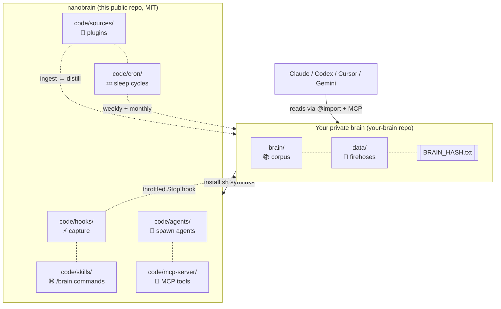

<div align="center">

# `nanobrain`

### the second brain that doesn't forget

**Markdown. Git. Forever.**

[](LICENSE)


[](https://github.com/siddsdixit/nanobrain)
[](https://twitter.com/intent/tweet?text=nanobrain%3A%20the%20second%20brain%20that%20doesn%27t%20forget.%20Markdown%20%2B%20git%20%2B%20your%20Claude%20Code%20sessions%2C%20self-improving%20forever.&url=https%3A%2F%2Fgithub.com%2Fsiddsdixit%2Fnanobrain)

> **Karpathy gave us [`nanoGPT`](https://github.com/karpathy/nanoGPT). Now meet `nanobrain`.**

</div>

---

## The pitch in 10 seconds

```bash
$ /brain who is jane

Jane Doe, recruiter at Acme. First contact 2026-03-12 (referred by Sam).
Last seen 2026-04-21 in Granola: pushed for the staff-eng loop. Open ask:
salary range. Backlinks: brain/projects.md (Acme thread), interactions.md (4).
```

```bash
$ /brain what's connected to project-x

8 backlinks. People: Jane, Sam, Marco. Decisions: 2026-03-04 (scope cut),
2026-04-09 (vendor pick). Open loops: pricing review, security audit.
```

Every Claude Code session ends. The signal is lost. Until now.

---

## What it is

`nanobrain` is a self-updating personal knowledge corpus. It captures every Claude Code session, distills signal across all your sources (Slack, Granola, Gmail, repos, voice memos), self-improves weekly, and stays vendor-neutral forever.

```
                    ┌──────────────────────────────────────────┐
   Claude session → │  Stop hook (throttled: 30 min OR 5 KB)   │
   Slack messages → │  →  data/<source>/INBOX.md (firehose)    │
   Granola mtg    → │  →  brain/raw.md          (cross-mirror) │
   Gmail thread   → │  →  brain/<category>.md   (distilled)    │
   Voice memo     → │  →  brain/_graph.md       (auto-linked)  │
                    └──────────────────────────────────────────┘
                                       │
                                       ▼
                       /brain who is jane
                       /brain what's connected to project-x
                       /brain spawn branding
                       /brain compact   ←  weekly
                       /brain evolve    ←  monthly self-improvement
```

The brain reads itself. Improves itself. Spawns its own tools. **Forever-durable.** `cat brain/self.md` works in 50 years on any system.

---

## Why this matters now

The LLM era ships a context problem. Every new session starts cold. Your model knows nothing about you, your projects, your people, your decisions. You re-explain. The model re-confuses. The signal you built up vanishes.

`nanobrain` is the missing layer. One markdown corpus. Every agent reads it. Every session adds to it. Compounds forever.

---

## 60-second quickstart

You need [Claude Code](https://claude.com/claude-code), a GitHub account, macOS or Linux.

```bash
# 1. Fork nanobrain
gh repo fork siddsdixit/nanobrain --clone

# 2. Create a PRIVATE repo for YOUR content
gh repo create my-brain --private
gh repo clone <yourname>/my-brain ~/my-brain

# 3. Install (wires hooks, skills, agents into ~/.claude/)
~/nanobrain/install.sh ~/my-brain

# 4. Open Claude Code anywhere
/brain who am I
```

That's it. Every session end now triggers a throttled capture into your private brain. Your identity, goals, projects, and people load into every new session automatically.

---

## What you get

| Capability | What it does |
|---|---|
| **8 slash commands** | `/brain`, `/brain-save`, `/brain-compact`, `/brain-evolve`, `/brain-checkpoint`, `/brain-spawn`, `/brain-graph`, `/brain-hash` |
| **Hardened capture** | Stop + SessionEnd + PreCompact hooks, recursion guard, lock file, timeout, atomic verify, audit log |
| **Three-tier architecture** | `brain/` (clean queryable), `data/` (raw firehoses), `code/` (machinery) |
| **Per-entity files** | One file per person, project, decision, concept. Single source of truth. |
| **Cross-linking graph** | `[[wikilinks]]` indexed automatically. `/brain links <name>` queries it. |
| **Agent foundry** | Spawn specialized agents with declared `reads:` / `writes:` scope |
| **MCP server** | 7 locked tools so Cursor / Codex / Gemini drive the brain natively |
| **Sleep cycles** | Weekly compact + monthly self-evolution via launchd |
| **Integrity audit** | `BRAIN_HASH.txt` detects corruption |
| **16 ADRs** | Every architecture decision documented |
| **29 invariants** | `code/SAFETY.md` rules the brain refuses to break |

---

## How it compares

|  | nanobrain | Notion / Reflect | Mem | Pinecone / Vector DB | RAG-as-a-service |
|---|:---:|:---:|:---:|:---:|:---:|
| Markdown native | ✅ | ❌ | ❌ | ❌ | ❌ |
| Works without internet | ✅ | ❌ | ❌ | ❌ | ❌ |
| Owns your data | ✅ | ❌ | ❌ | ❌ | ❌ |
| Readable in 50 years | ✅ | ❌ | ❌ | ❌ | ❌ |
| Self-improving | ✅ | ❌ | ⚠️ | ❌ | ❌ |
| Multi-agent (Claude / Cursor / Gemini) | ✅ | ❌ | ❌ | ⚠️ | ⚠️ |
| Token cost is constant | ✅ | n/a | n/a | ❌ | ❌ |
| Inheritable | ✅ | ❌ | ❌ | ❌ | ❌ |

The default second brain is a SaaS app or a vector DB. Both lock you in. Both die when the company pivots. Both struggle to give an LLM the right slice of context. `nanobrain` is the opposite bet: plain text, plain git, plain markdown, structured by humans, queried by agents.

---

## Architecture

<div align="center">



</div>

Two repos. The framework is public (this repo, MIT). Your content is private (your fork). They wire together with one symlink command. The pattern goes viral. Your life stays yours.

---

## The five magic words

```
/brain      ←  ask anything about you, your work, your people
/brain-save ←  force-save a decision or insight
/brain-compact  ←  weekly cleanup (refines, archives stale)
/brain-evolve   ←  monthly self-improvement (one targeted edit per cycle)
/brain-spawn    ←  mint a new agent from brain context
```

Six more in the framework. All composable. All idempotent. All reversible via `git revert`.

---

## FAQ

**Why not Obsidian / Logseq / Reflect?**
Those are great UIs. They are not multi-agent context substrates. nanobrain is the substrate. You can still use Obsidian on top, since it is the same markdown.

**Why not a vector DB?**
Token-budget protected, deterministic, greppable, inheritable. You can add a vector layer later if you want. Markdown stays the source of truth.

**Why not just CLAUDE.md?**
CLAUDE.md is one file. nanobrain is a corpus that grows, distills, and protects itself with 29 invariants and 16 ADRs.

**Will my brain leak through commits?**
Two repos. The public framework never sees your content. The private brain is yours. `data/_sensitive/` is gitignored by default.

**Does it actually work for long sessions?**
Throttled per-session. A week-long session triggers ~30 captures (every 4h or 5KB), not 200. Each capture passes only the delta to `claude -p`, not the full transcript. Cost grows linearly, not quadratically.

**What if I want to leave?**
`cat brain/self.md`. That is your exit strategy. Markdown. No migrations.

**Does it work with Cursor / Codex / Gemini?**
Yes. `AGENTS.md` and `GEMINI.md` ship as activation files. The MCP server exposes 7 locked tools any client can call.

**Is the framework usable without Claude Code?**
The Stop-hook capture is Claude-specific. Everything else (skills as markdown, MCP server, agents, sources, the corpus itself) is vendor-neutral. Bring your own runtime.

---

## Inspiration and lineage

- **Andrej Karpathy's LLM wiki** ([gist, Apr 2025](https://gist.github.com/karpathy/442a6bf555914893e9891c11519de94f)). The seed idea.
- **Karpathy's [`autoresearch`](https://github.com/karpathy/autoresearch)**. Git history as agent memory.
- **Vannevar Bush's memex** (1945). The original associative trail.
- **Obsidian, Logseq, Roam**. Wikilinks as a primitive.

---

## Roadmap

- [x] Day 1: framework, 8 slash commands, hooks, skills, MCP scaffold, 16 ADRs
- [ ] MCP server: replace stubs with real filesystem queries
- [ ] Source plugins: Slack, Granola, Gmail, repos, voice memos
- [ ] Cross-machine sync via `git pull --rebase --autostash`
- [ ] Plain-English `brain/README.md` per ADR-0013 (T27)
- [ ] Decay model and replay buffer (procedural memory upgrades)
- [ ] Encrypted `data/_sensitive/` via age or git-crypt
- [ ] Reference brand-voice / recruiter-replies / board-prep agents

---

## Contributing

Highest leverage: **new source integrations**. Pattern is `cp -R code/sources/_TEMPLATE code/sources/<your-source>`. See [CONTRIBUTING.md](CONTRIBUTING.md).

Issues, ideas, complaints: [open an issue](https://github.com/siddsdixit/nanobrain/issues).

---

## Star history

[](https://star-history.com/#siddsdixit/nanobrain&Date)

If this resonates, the easiest way to help is to **star the repo** and **share it**.

[](https://twitter.com/intent/tweet?text=nanobrain%3A%20the%20second%20brain%20that%20doesn%27t%20forget.%20Markdown%20%2B%20git%20%2B%20your%20Claude%20Code%20sessions%2C%20self-improving%20forever.&url=https%3A%2F%2Fgithub.com%2Fsiddsdixit%2Fnanobrain)

---

## License

[MIT](LICENSE). Fork it, customize it, build your own brain.

<div align="center">

---

**Built by [Sid Dixit](https://github.com/siddsdixit)**

<sub>The brain that doesn't forget. The framework that improves itself. Markdown + git, forever.</sub>

</div>
