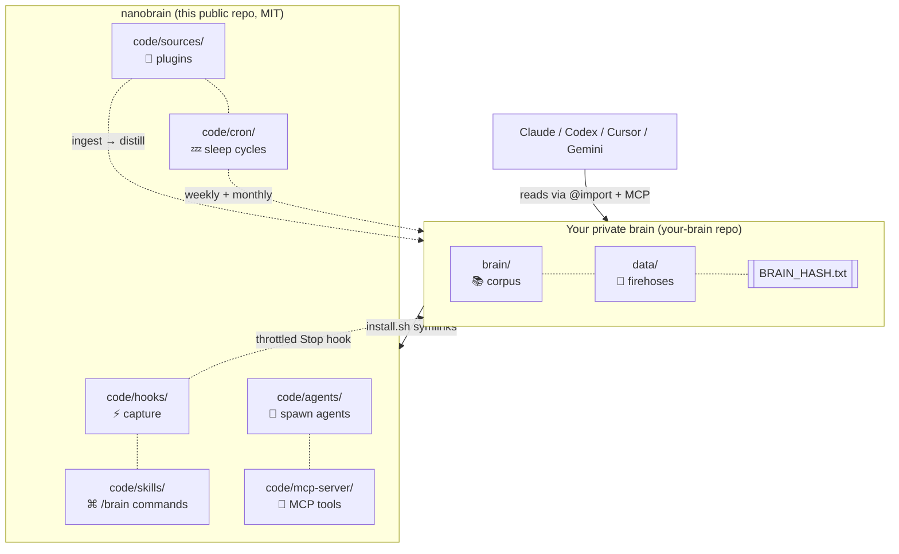

<div align="center">

# `nanobrain`

### your second brain in markdown

Multi-source capture · self-improving · vendor-neutral
Inspired by [Karpathy's LLM wiki](https://gist.github.com/karpathy/442a6bf555914893e9891c11519de94f), operationalized.

[](LICENSE)


[](https://github.com/siddsdixit/nanobrain)

> Karpathy gave us [`nanoGPT`](https://github.com/karpathy/nanoGPT). Now meet `nanobrain`.

</div>

---

## What it is

`nanobrain` captures every Claude Code session, distills signal across all your sources (Slack, Granola, Gmail, repos, voice memos), self-improves weekly, and stays vendor-neutral forever.

```
                    ┌──────────────────────────────────────────┐
   Claude session → │  Stop hook (throttled: 30 min OR 5 KB)   │
   Slack messages → │  →  data/<source>/INBOX.md (firehose)    │
   Granola mtg    → │  →  brain/raw.md          (cross-mirror) │
   Gmail thread   → │  →  brain/<category>.md   (distilled)    │
   Voice memo     → │  →  brain/_graph.md       (auto-linked)  │
                    └──────────────────────────────────────────┘
                                       │
                                       ▼
                       /brain who is jane
                       /brain what's connected to project-x
                       /brain spawn branding
                       /brain compact   ←  weekly
                       /brain evolve    ←  monthly self-improvement
```

The brain reads itself. Improves itself. Spawns its own tools. **Forever-durable** — `cat brain/self.md` works in 50 years on any system.

---

## Quick start

You need:
- [Claude Code](https://claude.com/claude-code)
- A GitHub account
- macOS or Linux

```bash
# 1. Fork nanobrain (this repo)
gh repo fork siddsdixit/nanobrain --clone

# 2. Create a PRIVATE repo for YOUR content
gh repo create my-brain --private
gh repo clone <yourname>/my-brain ~/my-brain

# 3. Install — wires hooks, skills, agents into ~/.claude/
~/nanobrain/install.sh ~/my-brain

# 4. Open Claude Code anywhere. Try:
/brain who am I
```

After install, every Claude Code session ends → throttled capture into your private brain. Your identity, goals, projects load into every new session automatically.

---

## What you get

| Capability | What it does |
|---|---|
| **8 slash commands** | `/brain`, `/brain-save`, `/brain-compact`, `/brain-evolve`, `/brain-checkpoint`, `/brain-spawn`, `/brain-graph`, `/brain-hash` |
| **Hardened capture** | Stop + SessionEnd + PreCompact hooks · recursion guard · lock file · timeout · atomic verify · audit log |
| **Three-tier architecture** | `brain/` (clean queryable) · `data/` (raw firehoses) · `code/` (machinery) |
| **Per-entity files** | One file per person, project, decision, concept. Single source of truth. |
| **Cross-linking graph** | `[[wikilinks]]` indexed automatically. `/brain links <name>` queries it. |
| **Agent foundry** | Spawn specialized agents with declared `reads:` / `writes:` scope |
| **MCP server** | 7 locked tools so Cursor / Codex / Gemini drive the brain natively |
| **Sleep cycles** | Weekly compact + monthly self-evolution via launchd |
| **Integrity audit** | `BRAIN_HASH.txt` detects corruption |
| **16 ADRs** | Every architecture decision documented |
| **29 invariants** | `code/SAFETY.md` rules the brain refuses to break |

---

## Why this beats vector DBs and SaaS second brains

- **No vendor lock.** Markdown + git is the only required dependency.
- **Token-budget protected.** `/brain` queries cost the same regardless of how much history you have.
- **Inheritable.** `cat brain/self.md` works without any tool. Your family or estate can read it in 50 years.
- **Self-improving.** Every session tightens the loop.
- **Sharable framework, private content.** Two repos. The pattern goes public; your life stays private.

---

## Architecture

<div align="center">



</div>

---

## Inspiration & lineage

- **Andrej Karpathy's LLM wiki** ([gist, Apr 2025](https://gist.github.com/karpathy/442a6bf555914893e9891c11519de94f)) — the seed idea
- **Karpathy's [`autoresearch`](https://github.com/karpathy/autoresearch)** — git history as agent memory
- **[Tolaria](https://github.com/refactoringhq/tolaria)** — flat-vault, conventions, MCP surface
- **Vannevar Bush's memex** (1945) — the original associative trail

---

## Status

**Day 1** (April 2026). Stable framework. Iterating on MCP server implementations and source integrations.

In production by [@siddsdixit](https://github.com/siddsdixit) — running multiple active threads from one Mac. The brain captures everything, distills across machines, self-improves weekly.

---

## Contributing

PRs welcome. Highest-leverage: **new source integrations** (Slack, Notion, Linear, etc.). Pattern is `cp -R code/sources/_TEMPLATE code/sources/<your-source>`. See [CONTRIBUTING.md](CONTRIBUTING.md).

Issues, ideas, complaints: [open an issue](https://github.com/siddsdixit/nanobrain/issues).

---

## License

[MIT](LICENSE). Fork it, customize it, build your own brain.

<div align="center">

---

**Built by [Sid Dixit](https://github.com/siddsdixit)**

<sub>The brain that doesn't forget. The framework that improves itself. Markdown + git, forever.</sub>

</div>
