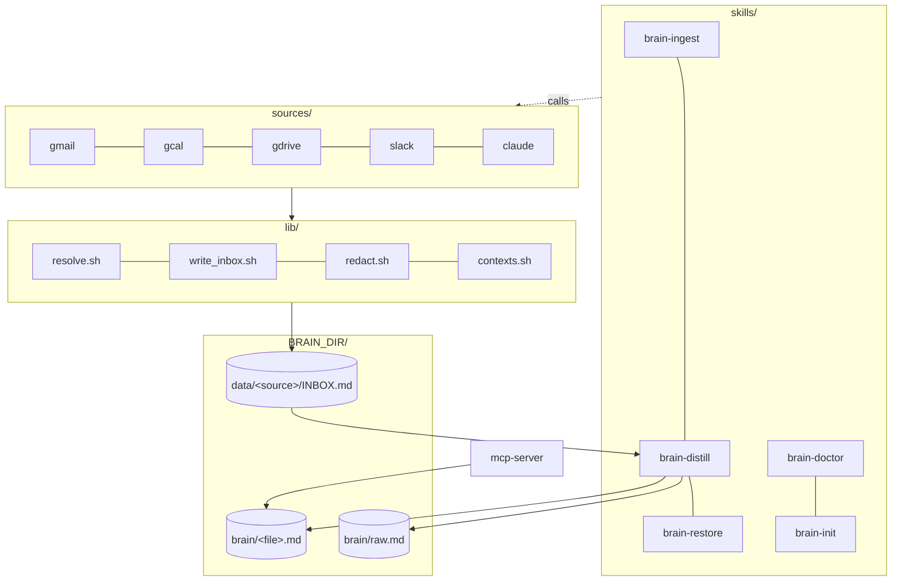

<div align="center">

# `nanobrain`

### the second brain that travels with you across every AI

**Markdown. Git. Vendor-neutral. Forever.**

[](LICENSE)
[](https://github.com/siddsdixit/nanobrain/actions)

[](https://github.com/siddsdixit/nanobrain)

> **Anthropic gave you Memory inside Claude. Google's giving you Memory inside Gemini. OpenAI's giving you Memory inside ChatGPT.**
>
> Each one locks you in.
>
> **`nanobrain` is the markdown + git equivalent. Yours forever, portable across every agent.**


</div>

---

## Built on Karpathy's LLM Wiki pattern

`nanobrain` is a faithful, code-shaped implementation of Andrej Karpathy's [LLM Wiki gist](https://gist.github.com/karpathy/442a6bf555914893e9891c11519de94f) (April 2026): three-layer corpus (raw / wiki / schema), immutable raw firehose, LLM-owned wiki, schema co-evolution via ADRs, git-native, source-dated entries.

What Karpathy described as a personal pattern, `nanobrain` ships as a framework: same structure, same discipline, plus the capture loop, lint, index, log, and graph machinery that keep the corpus honest at scale. See [`docs/adr/0002-no-yaml-frontmatter.md`](docs/adr/) for where we deviate (we don't).

---

## The pitch in 10 seconds

```bash
$ /brain who is jane

Jane Doe, recruiter at Acme. First contact 2026-03-12 (referred by Sam Park).
Last seen 2026-04-21: pushed for the staff-eng loop. Open ask: salary range.
Backlinks: brain/projects.md (Acme thread), interactions.md (4 entries).
```

```bash
$ /brain what's connected to ledger

8 backlinks. People: Priya Shah. Decisions: 2026-04-15 (Postgres pick),
2026-04-09 (drop multi-currency). Open loops: pricing model, pilot expansion.
```

---

## What it is

`nanobrain` captures every Claude Code session, distills signal from every source you connect (Gmail, Google Calendar, Google Drive, Slack), self-cleans weekly and self-improves monthly, and stores everything as plain markdown in your own git repo.

```
                    ┌──────────────────────────────────────────┐
   Claude session → │  Stop hook (throttled, secrets redacted) │
   Gmail threads  → │  →  data/<source>/INBOX.md (firehose)    │
   Calendar       → │  →  brain/raw.md          (cross-mirror) │
   Google Drive   → │  →  brain/<category>.md   (distilled)    │
   Slack          → │  →  brain/_graph.md       (auto-linked)  │
                    └──────────────────────────────────────────┘
                                       │
                                       ▼
                       /brain who is jane
                       /brain what's connected to project-x
                       /brain spawn branding-agent
                       /brain compact   ←  weekly
                       /brain evolve    ←  monthly self-improvement
                       /brain redact    ←  scrub a leaked secret
```

The brain reads itself. Improves itself. Spawns its own tools. **Forever-durable.** `cat brain/self.md` works in 50 years on any system.

---

## Why this matters now

Every major AI company is shipping Memory. Anthropic, Google, OpenAI all locked their version inside their own walled garden. Switch tools and you lose your context. Change pricing tiers and you lose history. Sunset the feature and your memory dies.

`nanobrain` is the bet that **your second brain should outlive any one vendor's roadmap.** Plain markdown. Plain git. Read by every agent. Owned by you.

The capture loop wires into Claude Code today. The MCP server exposes your brain to any agent that speaks MCP.

---

## Bootstrap

You need [Claude Code](https://claude.com/claude-code), a GitHub account, macOS or Linux. Install in 2 minutes; first capture lands in 30.

```bash
# 1. Clone the framework
git clone https://github.com/siddsdixit/nanobrain ~/nanobrain

# 2. Create a PRIVATE repo for YOUR brain content
gh repo create my-brain --private --clone

# 3. Install (wires hooks, skills, and Stop hook into Claude Code)
bash ~/nanobrain/install.sh ~/my-brain \
  --work you@company.com \
  --personal you@gmail.com \
  --gh-repo my-brain

# 4. Open Claude Code anywhere and have a conversation
# End the session. Then:
cat ~/my-brain/brain/decisions.md
```

Every session end triggers a throttled, secrets-redacted extract into your private brain. The capture hook fires every 30 minutes (or on 5KB of new transcript), so the first useful entries land within the first half-hour of normal use.

---

## What you get

Three loops, each one bash-only and reversible.

| Loop | What ships | How it works |
|---|---|---|
| **Capture** | Stop hook + 5 source ingests (gmail, gcal, gdrive, slack, claude) | Throttled (30 min / 5KB delta). Secrets-redacted by `code/lib/redact.sh` (OpenAI, Anthropic, GitHub, AWS, Slack, JWT, Bearer, inline `api_key=`). Tested in CI. |
| **Query** | `/brain` slash command + MCP server | Agents read brain files through `read_brain_file` with context-filter enforcement (work / personal). Firehoses (raw.md, INBOX.md) are refused. |
| **Maintain** | `/brain-compact` weekly, `/brain-evolve` monthly, `/brain-restore` on demand | Compact dedupes and archives stale entries. Evolve proposes one targeted edit per cycle. Restore creates a branch from any git tag — never resets, never force-pushes. |

Plus: per-entity pages (`brain/people/<slug>.md`, `brain/projects/<slug>.md`), `[[wikilink]]` backlink graph, operation log, auto-generated brain index, lint + integrity hash, agent foundry. Full skill list in [the 17 commands](#the-17-commands) below.

---

## How it compares

|  | nanobrain | Anthropic Memory | OpenAI Memory | Mem0 / Letta | Notion / Reflect | Vector RAG |
|---|:---:|:---:|:---:|:---:|:---:|:---:|
| Markdown native | ✅ | ❌ | ❌ | ❌ | ❌ | ❌ |
| Works without internet | ✅ | ❌ | ❌ | ⚠️ | ❌ | ❌ |
| You own the data | ✅ | ❌ | ❌ | ⚠️ | ❌ | ⚠️ |
| Readable in 50 years | ✅ | ❌ | ❌ | ❌ | ❌ | ❌ |
| Self-improving | ✅ | ✅ | ✅ | ⚠️ | ❌ | ❌ |
| Multi-agent (Claude / Cursor / Codex / Gemini) | ✅ | ❌ | ❌ | ⚠️ | ❌ | ⚠️ |
| Token cost is constant | ✅ | n/a | n/a | n/a | n/a | ❌ |
| Readable by grep | ✅ | ❌ | ❌ | ❌ | ❌ | ❌ |
| Open source | ✅ MIT | ❌ | ❌ | mixed | ❌ | mixed |

---

## Architecture

Two repos. The framework is public (this repo, MIT). Your content is private (your brain repo). They wire together with one install command.

<div align="center">



</div>

For the capture sequence and three-destination routing diagrams, see [`docs/ARCHITECTURE.md`](docs/ARCHITECTURE.md).

---

## The 17 commands

```
/brain            ←  query: paths / status / links
/brain-save       ←  force-save a decision or insight mid-session
/brain-ingest     ←  pull one source into INBOX
/brain-distill    ←  distill INBOX entries into brain files
/brain-init       ←  scaffold _contexts.yaml for a new brain
/brain-doctor     ←  health check: contexts, sources, GitHub sync
/brain-index      ←  rebuild brain/index.md catalog
/brain-log        ←  append one op line to brain/log.md
/brain-lint       ←  catch orphan pages, broken refs, missing context tags
/brain-graph      ←  rebuild [[wikilink]] backlink index
/brain-hash       ←  integrity check: build or verify BRAIN_HASH.txt
/brain-spawn      ←  mint a new scoped agent from brain context
/brain-compact    ←  weekly cleanup (dedupes, archives stale entries)
/brain-evolve     ←  monthly self-improvement (one targeted proposal per cycle)
/brain-checkpoint ←  force-capture mid-session
/brain-redact     ←  scrub a leaked secret from git history (last resort)
/brain-restore    ←  restore to any checkpoint via a new branch (non-destructive)
```

All idempotent. All reversible via `git revert` (except `/brain-redact` which rewrites history by design).

---

## FAQ

**How is this different from Anthropic Memory / ChatGPT Memory / Gemini Memory?**
Those are vendor-locked. Switch tools and you lose your memory. `nanobrain` is markdown + git in your own repo. Read by Claude today, readable by any agent or human tomorrow.

**Does it leak my secrets to Anthropic when capture runs?**
No. `code/hooks/redact.sh` runs over every transcript delta before `claude -p` ever sees it, stripping common token formats (OpenAI / Anthropic / GitHub / AWS / Slack / Bearer / JWT / inline `api_key=`). Tested in CI. Best-effort — use `/brain-redact <pattern>` if anything slips through.

**Why not Obsidian / Logseq / Reflect?**
Great UIs. Not multi-agent context substrates. nanobrain is the substrate. Obsidian works fine on top since it reads the same markdown.

**Why not a vector DB?**
Token-budget protected, deterministic, greppable, inheritable. Add a vector layer later if you want. Markdown stays the source of truth.

**Why not just CLAUDE.md?**
CLAUDE.md is one file. nanobrain is a corpus that grows, distills, self-lints, and protects itself.

**Will my brain leak through commits?**
Two repos. The public framework never sees your content. Your private brain is yours. Push failures surface immediately in `/brain-doctor`.

**What if I want to leave?**
`cat brain/self.md`. That is your exit strategy. No migrations, no exports, no vendor permission required.

**Does it work on Linux?**
The bash core works on Linux 3.2+. The launchd cron plists are macOS-only -- on Linux, add equivalent cron entries manually. See `code/cron/`.

---

## Documentation

- [PRD.md](docs/PRD.md) — product requirements (v1 reference; v2 simplifications in ADR 0001)
- [SPEC.md](docs/SPEC.md) — engineering specification (27 stories, 6 phases)
- [ARCHITECTURE.md](docs/ARCHITECTURE.md) — system + capture flow + routing diagrams
- [ARCHITECTURE-DETAILED.md](docs/ARCHITECTURE-DETAILED.md) — deep dive (v1 reference)
- [docs/sprints/](docs/sprints/) — sprint briefs S01–S09 (foundations → migration)
- [docs/adr/](docs/adr/) — architecture decision records

---

## Inspiration and lineage

- **Andrej Karpathy's LLM wiki** ([gist, Apr 2026](https://gist.github.com/karpathy/442a6bf555914893e9891c11519de94f)). The seed idea: three-layer corpus, immutable raw, LLM-owned wiki, git-native.
- **Karpathy's [`autoresearch`](https://github.com/karpathy/autoresearch)**. Git history as agent memory.
- **Vannevar Bush's memex** (1945). The original associative trail.
- **Obsidian, Logseq, Roam**. Wikilinks as a primitive.

---

## Roadmap

- [x] v2.0: 17 skills, 5 sources (gmail/gcal/gdrive/slack/claude), MCP server, Karpathy alignment (index, log, lint), 173/173 tests green
- [ ] v2.1: Codex CLI + Gemini CLI capture wrappers
- [ ] v2.2: Source plugins — voice memos, Granola meeting notes, repos
- [ ] v2.3: `nanobrain-web` browser extension for `claude.ai` / `chatgpt.com` / `gemini.google.com`
- [ ] v3.0: Optional vector sidecar (markdown stays source of truth), encrypted `data/_sensitive/`

---

## Contributing

Highest leverage: **new source integrations**. The pattern is straightforward — see `code/sources/gmail/` as the reference implementation and copy from there.

Issues, ideas, complaints: [open an issue](https://github.com/siddsdixit/nanobrain/issues).

---

## Star history

[](https://star-history.com/#siddsdixit/nanobrain&Date)

If this resonates, starring the repo and sharing it is the highest-leverage thing you can do.

---

## License

[MIT](LICENSE). Fork it, customize it, build your own brain.

<div align="center">

---

**Built by [Sid Dixit](https://github.com/siddsdixit)**

<sub>The brain that doesn't forget. The framework that improves itself. Markdown + git, forever.</sub>

</div>
