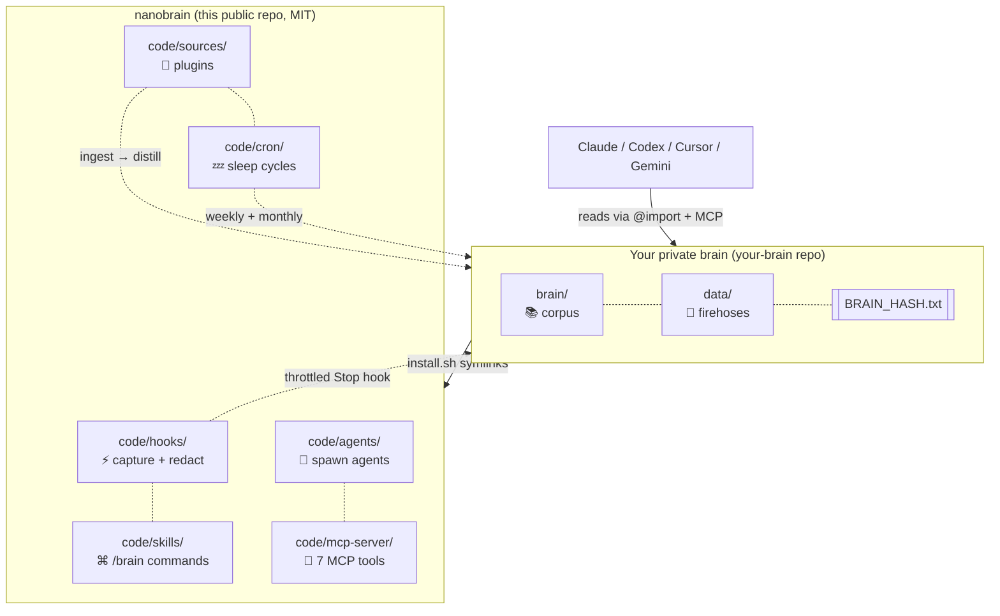

<div align="center">

# `nanobrain`

### the second brain that travels with you across every AI

**Markdown. Git. Vendor-neutral. Forever.**

[](LICENSE)
[](https://github.com/siddsdixit/nanobrain/actions)


[](https://github.com/siddsdixit/nanobrain)

> **Anthropic gave you Memory inside Claude. Google's giving you Memory inside Gemini. OpenAI's giving you Memory inside ChatGPT.**
>
> Each one locks you in.
>
> **`nanobrain` is the markdown + git equivalent. Yours forever, portable across every agent.**


</div>

---

## The pitch in 10 seconds

```bash
$ /brain who is jane

Jane Doe, recruiter at Acme. First contact 2026-03-12 (referred by Sam Park).
Last seen 2026-04-21: pushed for the staff-eng loop. Open ask: salary range.
Backlinks: brain/projects.md (Acme thread), interactions.md (4 entries).
```

```bash
$ /brain what's connected to ledger

8 backlinks. People: Priya Shah. Decisions: 2026-04-15 (Postgres pick),
2026-04-09 (drop multi-currency). Open loops: pricing model, pilot expansion.
```

Try it yourself: `BRAIN_DIR=examples/starter-brain` plus the MCP server, no install required. The example brain has Jane, Ledger, and three real-shaped decisions baked in.

---

## What it is

`nanobrain` captures every Claude Code session, distills signal from every source you connect (Slack, Granola, Gmail, repos, voice memos), self-improves weekly, and stores everything as plain markdown in your own git repo.

```
                    ┌──────────────────────────────────────────┐
   Claude session → │  Stop hook (throttled, secrets redacted) │
   Slack messages → │  →  data/<source>/INBOX.md (firehose)    │
   Granola mtg    → │  →  brain/raw.md          (cross-mirror) │
   Gmail thread   → │  →  brain/<category>.md   (distilled)    │
   Voice memo     → │  →  brain/_graph.md       (auto-linked)  │
                    └──────────────────────────────────────────┘
                                       │
                                       ▼
                       /brain who is jane
                       /brain what's connected to project-x
                       /brain spawn branding
                       /brain compact   ←  weekly
                       /brain evolve    ←  monthly self-improvement
                       /brain redact    ←  scrub a leaked secret
```

The brain reads itself. Improves itself. Spawns its own tools. **Forever-durable.** `cat brain/self.md` works in 50 years on any system.

---

## Why this matters now

Every major AI company is shipping Memory. Anthropic, Google, OpenAI all locked their version inside their own walled garden. If you switch tools, you lose your context. If they change pricing, you pay. If they sunset the feature, your memory dies.

`nanobrain` is the bet that **your second brain should outlive any one vendor's roadmap.** Plain markdown. Plain git. Read by every agent. Owned by you.

The capture loop wires into Claude Code today. AGENTS.md and GEMINI.md ship at the repo root for Codex, Cursor, Aider, Gemini CLI. Browser-extension capture for the web tools is on the roadmap.

---

## 60-second quickstart

You need [Claude Code](https://claude.com/claude-code), a GitHub account, macOS or Linux.

```bash
# 1. Fork nanobrain
gh repo fork siddsdixit/nanobrain --clone

# 2. Create a PRIVATE repo for YOUR content
gh repo create my-brain --private
gh repo clone <yourname>/my-brain ~/my-brain

# 3a. Try it FIRST without touching ~/.claude
~/nanobrain/code/install.sh --dry-run ~/my-brain   # shows what would change
~/nanobrain/code/install.sh --read-only ~/my-brain # scaffolds brain dir only

# 3b. Full install (wires hooks, skills, agents into ~/.claude/)
~/nanobrain/code/install.sh ~/my-brain

# 4. Open Claude Code anywhere
/brain who am I
```

Every session end now triggers a throttled, secrets-redacted capture into your private brain. Your identity, goals, projects, and people load into every new session automatically.

---

## What you get

| Capability | What it does |
|---|---|
| **9 slash commands** | `/brain`, `/brain-save`, `/brain-compact`, `/brain-evolve`, `/brain-checkpoint`, `/brain-spawn`, `/brain-graph`, `/brain-hash`, `/brain-redact` |
| **Hardened capture** | Stop + SessionEnd + PreCompact hooks, recursion guard, lock with PID + timestamp, timeout, atomic verify, audit log |
| **Defense-in-depth secrets filter** | `code/hooks/redact.sh` strips OpenAI / Anthropic / GitHub / AWS / Slack tokens, JWTs, Bearer tokens, and inline `password=` / `api_key=` patterns BEFORE any transcript leaves your machine. Tested in CI. |
| **Three-tier architecture** | `brain/` (clean queryable), `data/` (raw firehoses), `code/` (machinery) |
| **Per-entity files** | One file per person, project, decision, concept. Single source of truth. |
| **Cross-linking graph** | `[[wikilinks]]` indexed automatically. `/brain links <name>` queries it. |
| **Agent foundry** | Spawn specialized agents with declared `reads:` / `writes:` scope |
| **MCP server** | 7 tools (search / get / list / relationships / query-graph / inbox / status). All implemented, all tested. |
| **Sleep cycles** | Weekly compact + monthly self-evolution via launchd |
| **Integrity audit** | `BRAIN_HASH.txt` detects corruption |
| **Secret recovery** | `/brain-redact <pattern>` rewrites git history, force-pushes, and logs the redaction |
| **16 ADRs + 29 invariants** | Every architecture decision documented; rules the brain refuses to break |

---

## How it compares

|  | nanobrain | Anthropic Memory | OpenAI Memory | Mem0 / Letta | Notion / Reflect | Vector RAG |
|---|:---:|:---:|:---:|:---:|:---:|:---:|
| Markdown native | ✅ | ❌ | ❌ | ❌ | ❌ | ❌ |
| Works without internet | ✅ | ❌ | ❌ | ⚠️ | ❌ | ❌ |
| You own the data | ✅ | ❌ | ❌ | ⚠️ | ❌ | ⚠️ |
| Readable in 50 years | ✅ | ❌ | ❌ | ❌ | ❌ | ❌ |
| Self-improving | ✅ | ✅ | ✅ | ⚠️ | ❌ | ❌ |
| Multi-agent (Claude / Cursor / Codex / Gemini) | ✅ | ❌ | ❌ | ⚠️ | ❌ | ⚠️ |
| Token cost is constant | ✅ | n/a | n/a | n/a | n/a | ❌ |
| Inheritable | ✅ | ❌ | ❌ | ❌ | ❌ | ❌ |
| Open source | ✅ MIT | ❌ | ❌ | mixed | ❌ | mixed |

The default second brain is a SaaS app, a vector DB, or now a vendor's built-in Memory feature. They all lock you in. They all die when the company pivots. They all struggle to give a *different* LLM the right slice of context.

`nanobrain` is the opposite bet: plain text, plain git, structured by humans, queried by every agent.

---

## Architecture

<div align="center">



</div>

Two repos. The framework is public (this repo, MIT). Your content is private (your fork). They wire together with one symlink command. The pattern goes viral. Your life stays yours.

---

## The nine magic words

```
/brain          ←  ask anything about you, your work, your people
/brain-save     ←  force-save a decision or insight
/brain-compact  ←  weekly cleanup (refines, archives stale)
/brain-evolve   ←  monthly self-improvement (one targeted edit per cycle)
/brain-spawn    ←  mint a new agent from brain context
/brain-graph    ←  build the [[wikilink]] backlink index
/brain-hash     ←  integrity check via BRAIN_HASH.txt
/brain-checkpoint ← force-capture mid-session
/brain-redact   ←  scrub a leaked secret from history (last resort)
```

All composable. All idempotent. All reversible via `git revert`.

---

## FAQ

**How is this different from Anthropic Memory / ChatGPT Memory / Gemini Memory?**
Those are vendor-locked. Switch tools and you lose your memory. `nanobrain` is markdown + git in your own repo. Read by Claude today, by Codex / Gemini / Cursor via `AGENTS.md`, by future tools that haven't been built yet.

**Does it leak my secrets to Anthropic when capture runs?**
No. `code/hooks/redact.sh` runs over every transcript delta before `claude -p` ever sees it, stripping common token formats (OpenAI / Anthropic / GitHub / AWS / Slack / Bearer / JWT / inline `api_key=`). Tested in CI. Best-effort, not guaranteed; for safety use `/brain-redact <pattern>` if anything slips through.

**Why not Obsidian / Logseq / Reflect?**
Those are great UIs. They are not multi-agent context substrates. nanobrain is the substrate. You can still use Obsidian on top, since it is the same markdown.

**Why not a vector DB?**
Token-budget protected, deterministic, greppable, inheritable. You can add a vector layer later if you want. Markdown stays the source of truth.

**Why not just CLAUDE.md?**
CLAUDE.md is one file. nanobrain is a corpus that grows, distills, and protects itself with 29 invariants and 16 ADRs.

**Will my brain leak through commits?**
Two repos. The public framework never sees your content. The private brain is yours. `data/_sensitive/` is gitignored by default.

**Does it actually work for long sessions?**
Throttled per-session. A week-long session triggers ~30 captures (every 4h or 5KB), not 200. Each capture passes only the delta to `claude -p`, not the full transcript. Cost grows linearly, not quadratically.

**What if I want to leave?**
`cat brain/self.md`. That is your exit strategy. Markdown. No migrations.

**Does it work with Cursor / Codex / Gemini today?**
Read side: yes (`AGENTS.md` and `GEMINI.md` ship at the repo root). Capture side: not yet — wrapper scripts are on the [roadmap](#roadmap) and the `[good first issue]` list. See [COMPATIBILITY.md](COMPATIBILITY.md).

**Is the framework usable without Claude Code?**
The Stop-hook capture is Claude-specific today. Everything else (skills as markdown, MCP server, agents, sources, the corpus itself) is vendor-neutral. Bring your own runtime.

---

## Inspiration and lineage

- **Andrej Karpathy's LLM wiki** ([gist, Apr 2026](https://gist.github.com/karpathy/442a6bf555914893e9891c11519de94f)). The seed idea.
- **Karpathy's [`autoresearch`](https://github.com/karpathy/autoresearch)**. Git history as agent memory.
- **Vannevar Bush's memex** (1945). The original associative trail.
- **Obsidian, Logseq, Roam**. Wikilinks as a primitive.

---

## Roadmap

- [x] v0.1.0: framework, 9 slash commands, hardened capture, secrets filter, MCP server with real implementations, smoke test in CI, 16 ADRs
- [ ] v0.2: Codex CLI + Gemini CLI capture wrappers (no native Stop hook → wrapper script)
- [ ] v0.3: Source plugins live (Slack, Granola, Gmail, repos, voice memos)
- [ ] v0.4: `nanobrain-web` browser extension for `claude.ai` / `chatgpt.com` / `gemini.google.com`
- [ ] v0.5: Vector layer optional sidecar (markdown stays source of truth)
- [ ] v1.0: Encrypted `data/_sensitive/` via age or git-crypt, decay model for procedural memory

---

## Contributing

Highest leverage: **new source integrations** and **agent runtime wrappers**. Pattern is `cp -R code/sources/_TEMPLATE code/sources/<your-source>`. See [CONTRIBUTING.md](CONTRIBUTING.md) and [COMPATIBILITY.md](COMPATIBILITY.md).

Issues, ideas, complaints: [open an issue](https://github.com/siddsdixit/nanobrain/issues).

---

## Star history

[](https://star-history.com/#siddsdixit/nanobrain&Date)

If this resonates, the easiest way to help is to **star the repo** and **share it**.

---

## License

[MIT](LICENSE). Fork it, customize it, build your own brain.

<div align="center">

---

**Built by [Sid Dixit](https://github.com/siddsdixit)**

<sub>The brain that doesn't forget. The framework that improves itself. Markdown + git, forever.</sub>

</div>
