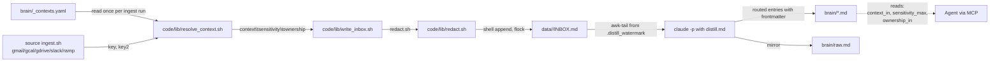
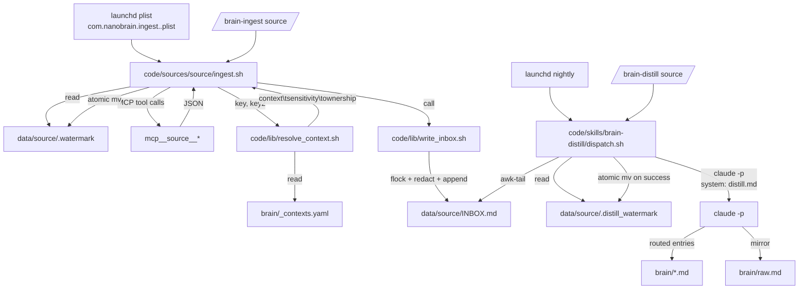
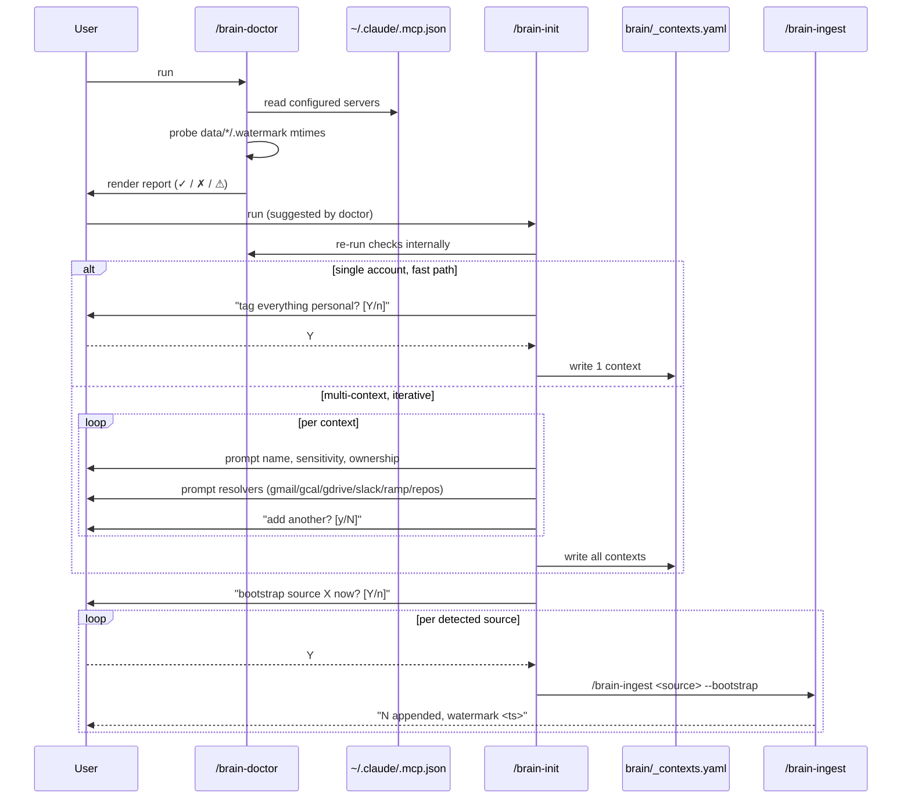
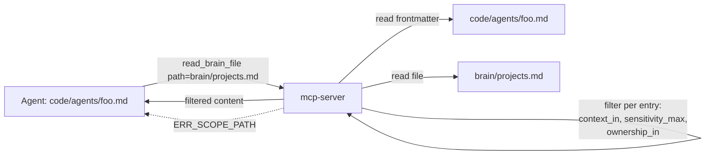

# ARCHITECTURE v1.0 — nanobrain multi-source ingest

> **Note:** This document describes the v1.0 design. The shipped v2.0 simplified to **two contexts** (work / personal) and dropped sensitivity / ownership axes. See [adr/0001-v2-lean-design.md](adr/0001-v2-lean-design.md) for what changed.


**Status:** Engineering-locked.
**Owner:** Sid Dixit ([siddsdixit](https://github.com/siddsdixit)).
**Scope:** v1.0 only. Augments `<repo>/docs/ARCHITECTURE.md` (framework). This file lives in the private corpus because it documents private-content concerns (resolver tables, agent scope, sensitivity tiers).

This doc covers the six v1.0 system additions:

1. Multi-axis tag pipeline.
2. Source pipeline reference architecture.
3. Onboarding flow (`/brain-doctor` → `/brain-init` → `/brain-ingest`).
4. Agent scope enforcement (brain MCP read-server).
5. Pre-commit mirror enforcement.
6. Failure modes added to v0.x failure-mode table.

Public framework migrations are listed at the bottom under "to migrate to nanobrain/docs/".

---

## 1. Multi-axis tag pipeline

Every ingested entry carries three axes: `context`, `sensitivity`, `ownership` (optional). The pipeline:



**Determinism guarantees:**

- `_contexts.yaml` is read once at the start of an ingest run and cached in an associative array. Same input → same tuple.
- `redact.sh` runs **before** the `>>` append to INBOX. Secrets never reach disk in INBOX form.
- Distill consumes the v1.0 entry header and propagates `sensitivity` and `ownership` into the front-matter of every routed `brain/*.md` entry.
- `sensitive` (legal/medical) is a fourth tier that bypasses `brain/` entirely and lands in `data/_sensitive/` (gitignored). S9, S18.

**Ownership defaults:** `_contexts.yaml` omits `ownership:` for solo users. The resolver returns the literal string `unset` (not the empty string) so downstream parsers have a single sentinel. `write_inbox.sh` skips the `ownership:` line when the value is `unset`. Spec O-1.

---

## 2. Source pipeline reference architecture

Universal shape generalized from `code/sources/{repos,granola}/`. Every v1.0 source (gmail, gcal, gdrive, slack, ramp) follows it.



**Named components:**

- **ingest.sh** — pure shell, MCP client, idempotent. One per source. Exit codes per spec §3.3.
- **.watermark** — upstream timestamp (last item we pulled). ISO 8601, single line.
- **.distill_watermark** — local-capture timestamp (last INBOX entry distilled).
- **resolver** — `code/lib/resolve_context.sh`. Pure function. Stateless across runs.
- **write_inbox.sh** — append helper. Owns `flock` and `redact` invocation. Single point of truth for entry format (S2, S2a).
- **distill.md** — system prompt for `claude -p`. The contract. Vendor-neutral runner is v1.5 (spec O-3).

**Per-source files (six files plus a plist):**

```
code/sources/<source>/
  ingest.sh              # MCP client, calls write_inbox.sh
  ingest.md              # human-readable spec for what this source does
  distill.md             # claude -p system prompt for routing
  requires.yaml          # mcp: <name> AND/OR binaries: [yq, jq]
  context_resolver.sh    # thin wrapper that calls code/lib/resolve_context.sh with source-specific keys
  test_resolver.sh       # table-driven test cases, runs in CI
code/cron/com.nanobrain.ingest.<source>.plist
```

**Adding a new source = copy `_TEMPLATE/`, fill in.** Never touch other source code (S11).

---

## 3. Onboarding flow

User opens a fresh machine. Goal: green `/brain-doctor` and at least one source ingesting in under 5 minutes.



**Idempotency:** `/brain-init` refuses to overwrite an existing `_contexts.yaml` without `--force`. Default behavior on re-run is `--add-context` mode.

**No-MCP fallback:** if `~/.claude/.mcp.json` is missing, `/brain-doctor` reports "no MCPs configured" and `/brain-init` skips the per-source bootstrap step. The user can still configure resolvers for sources they will add later.

**Default resolution:** `_contexts.yaml` ships with `defaults: { context: personal, sensitivity: private, ownership: unset }`. Spec O-9.

---

## 4. Agent scope enforcement

The brain MCP server (`code/mcp-server/index.js`, already scaffolded) is the enforcement point. v1.0 adds the `read_brain_file` tool. Agents go through this tool; the server filters per the agent's declared scope.

**API surface (v1.0):**

```
tool: read_brain_file
input:
  agent_slug: string         # required; the calling agent's identity
  path: string               # required; brain file to read
output:
  ok: boolean
  content: string            # filtered markdown, may be shorter than file
  filtered_count: integer    # entries removed by filter
errors:
  ERR_SCOPE_PATH             # path not in agent's reads.paths
  ERR_AGENT_NOT_FOUND        # no code/agents/<slug>.md
  ERR_AGENT_MALFORMED        # frontmatter missing reads block
```

**Algorithm:**

1. Read `code/agents/<agent_slug>.md` front-matter.
2. Match `path` against `reads.paths` (exact or glob via `**`). Mismatch → `ERR_SCOPE_PATH`.
3. Read the file. Parse entries delimited by `### ` headers.
4. Per entry, parse the frontmatter block (the lines under the `### ` header up to the first blank line — `context:`, `sensitivity:`, `ownership:`).
5. Drop entries where:
   - `context` not in `reads.context_in` (skip check if list empty).
   - `sensitivity > reads.sensitivity_max` (hierarchy: `public < private < confidential`).
   - `ownership` not in `reads.ownership_in` (skip check if list empty).
6. Return concatenated kept entries, plus `filtered_count`.

**Why server-enforced:** if the filter were in the agent prompt, a misbehaving model could ignore it. Putting it in the MCP server makes it physically impossible to read out-of-scope content. S29.

**Where the existing `brain_search` and `brain_get_entity` tools fit:** they already restrict to canonical files (`brain/{self,...}.md` and per-entity files) and skip `raw.md` and `data/`. v1.0 adds the per-entry filter on top of that path filter.



---

## 5. Pre-commit mirror enforcement

S2a (mirror rule) is currently obedience-based. v1.0 makes it mechanical via a git pre-commit hook.

**Logic:**

```mermaid
flowchart TD
  C[git commit] --> H[.git/hooks/pre-commit<br/>→ code/hooks/pre-commit/mirror-check.sh]
  H --> S{any staged file<br/>in brain/{self,goals,projects,<br/>people,learnings,decisions,repos}.md ?}
  S -->|no| OK[exit 0]
  S -->|yes| R{brain/raw.md also staged<br/>with appended lines?}
  R -->|yes| OK
  R -->|no| B{MIRROR_OK=1 in env?}
  B -->|yes| OK
  B -->|no| FAIL[exit 1<br/>print 'mirror rule violated']
```

**Detection mechanism:** `git diff --cached --name-only` lists staged paths. For `brain/raw.md`, the hook also confirms the diff is **append-only** (the existing content is preserved as a prefix; only new lines added at the end). This catches accidental edits to raw.md that would corrupt the firehose.

**Bypass:** `MIRROR_OK=1 git commit ...` for documented bulk rewrites. The hook prints a one-line warning when the bypass is used so it stays auditable.

**Install:** `install.sh` symlinks `code/hooks/pre-commit/mirror-check.sh` into `<brain>/.git/hooks/pre-commit`. If a pre-commit hook already exists, `install.sh` chains them (existing hook runs first; if it exits 0, mirror-check runs).

---

## 6. Failure modes (additions to existing table)

| Failure | Symptom | Detection | Recovery |
|---|---|---|---|
| Bad context tag | INBOX entry has `context: personal` when user expected `work` | grep INBOX, compare to `_contexts.yaml`; resolver test cases | edit `_contexts.yaml`; re-run ingest with `--bootstrap` for the affected window; old entries stay in firehose (S24) |
| MCP disconnected mid-ingest | `ingest.sh` exit 3 or 4; partial INBOX append possible | exit code; `[ingest <source>]` stderr line | watermark NOT advanced on early exit; next run resumes from last successful timestamp; user re-auths the MCP |
| Distill watermark drift | `brain/raw.md` and INBOX disagree on entry count | nightly `/brain-doctor`; `BRAIN_HASH.txt` mismatch | `git log brain/raw.md` to find the divergence; manually advance `.distill_watermark` past the bad batch; never bulk-rewrite raw.md |
| Mirror-check rejects commit | `git commit` exits 1 with "mirror rule violated" | hook output | re-run distill so it appends to raw.md; or stage raw.md update by hand; or `MIRROR_OK=1` for a known bulk op |
| Resolver returns default unexpectedly | Many `personal/private/unset` entries from a known work source | resolver stderr "no match for X" line repeated | add the missing rule to `_contexts.yaml`; `code/lib/validate_contexts.sh` confirms; re-run |
| `_contexts.yaml` malformed | All ingests fail | `validate_contexts.sh` exit 1 with line number | fix YAML; commit; ingests resume |
| Two ingests collide | second exits 2 within 1s | `.ingest.lock` flock | wait or kill the stuck process; lock auto-releases on exit |
| Distill malformed output | watermark NOT advanced; entries stay in INBOX | distill exit 5 | re-run distill; if persistent, inspect `claude -p` response in `data/<source>/.distill.last.log` |
| Sensitive content in `brain/` | a `sensitive`-tagged entry mirrored to raw.md | grep raw.md for `sensitivity: sensitive` | the sensitive tier should NEVER mirror; this is a bug. File ADR, fix routing, force-rewrite raw.md only via documented bulk-rewrite procedure |

---

## 7. To migrate to `nanobrain/docs/` (public framework)

These sections are framework-general (not corpus-specific) and should ship in the public repo as part of the v1.0 release. List for the eventual split:

- §2 Source pipeline reference architecture (the universal shape diagram + `_TEMPLATE/` description). Already partially in `_TEMPLATE/README.md`.
- §3 Onboarding flow (sequence diagram). Pairs with the README rewrite (NBN-124).
- §4 Agent scope enforcement (the algorithm and the locked tool API). Goes in `nanobrain/docs/MCP-SERVER.md` or extends the existing tool README.
- §5 Pre-commit mirror enforcement diagram. Goes in `nanobrain/docs/SAFETY-HOOKS.md` (new) or as an addendum to `code/SAFETY.md` near S2a.

Private-only (stays here):

- §1 Multi-axis tag pipeline (refers to ownership tiers tied to user contexts).
- §6 Failure modes (operator-facing recovery; references private state).

The sprint plan calls out the split per-step.
