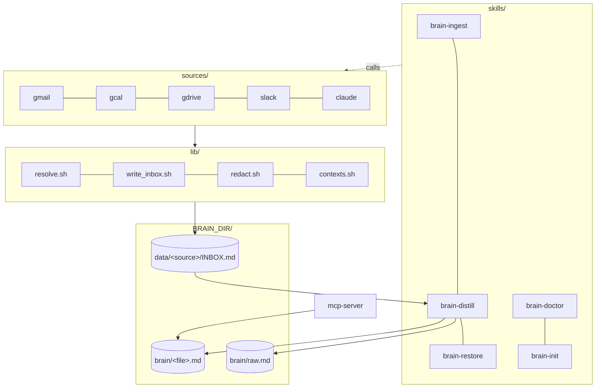
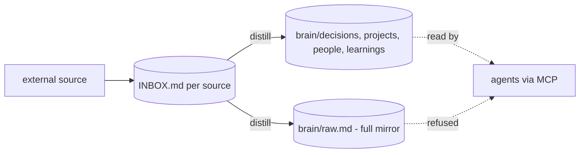

# nanobrain v2 architecture

One axis: `context: work | personal`. Two contexts max. Solo users get just `personal`.

## Layered system



## Capture flow

```mermaid
sequenceDiagram
  autonumber
  participant U as user / cron / Stop hook
  participant Sk as brain-ingest
  participant So as sources/&lt;src&gt;/ingest.sh
  participant L as lib/{resolve, redact, write_inbox}
  participant I as data/&lt;src&gt;/INBOX.md
  participant Di as brain-distill
  participant B as brain/&lt;file&gt;.md
  participant R as brain/raw.md

  U->>Sk: dispatch.sh gmail
  Sk->>So: ingest.sh
  So->>L: resolve_context(source, key)
  L-->>So: work | personal
  So->>L: write_inbox.sh (atomic, redact)
  L->>I: append entry (timestamp + provenance + {context})
  U->>Di: dispatch.sh gmail
  Di->>I: read INBOX
  Di-->>Di: claude -p distill.md (or stub)
  Di->>B: append targeted blocks
  Di->>R: append full mirror
```

## Three-destination routing

Every signal lands in three places. Trace any line back to its origin via `source_id`.



INBOX entry shape (`data/<src>/INBOX.md`):

```
-- 2026-04-28 14:33 --
source: gmail
sender: vc@firm.com
subject: Re: investor intro
source_id: thread_abc
{context: work}

(redacted body, max 500 chars)
```

Brain entry shape (`brain/decisions.md`):

```
## 2026-04-28 14:33 (from gmail)
{source_id: thread_abc, context: work}
- decision text...
```

raw.md mirror keeps the full pre-routed block.

## What v2 dropped (vs v1.0)

See `docs/adr/0001-v2-lean-design.md`. Short list: sensitivity, ownership, pre-commit mirror enforcement, firehose rotation, two-pass gmail bootstrap, brain-spawn, brain-graph, brain-hash, brain-redact, brain-checkpoint, brain-distill-all.
